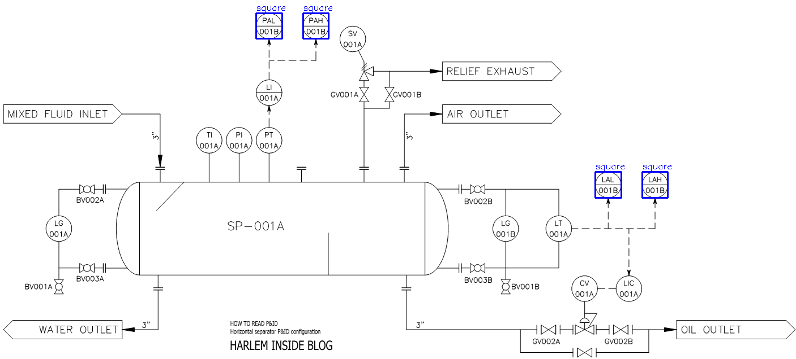

# Linewalksqr Example

# Setup
```
pip install -r requirements.txt
```

<br>

# Run the script
You may need to tweak the parameters based on your specific use case.

```
python linewalksqr.py ./results/image_1.png --min-side-len 10 --max-side-len 60 --threshold 150
```

# Results
### Before


### After



