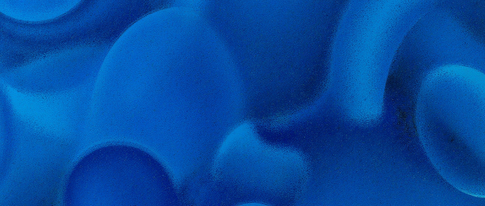

# LineWalkSQR: A Simple Algorithm for Detecting Perfect Squares in Greyscale Images  
**Authors:** Robby Boney, OpenAI o1 <br>
**Date:** 1-25-2025

<br>

## Abstract
In industrial engineering, Process and Instrumentation Diagrams (P&IDs) are integral for depicting the various control and instrumentation systems used in complex processes. Within these diagrams, certain symbolic notations (e.g., control boxes) are often drawn as perfect squares. Detecting such shapes automatically is valuable for indexing, cataloging, or transforming P&ID diagrams into digital form.  

We present **LineWalkSQR**, a simple yet effective algorithm that scans a binarized input image pixel by pixel, measures run lengths horizontally and vertically, and identifies perfect squares of a specified size range. Our approach includes a post-processing stage that removes overlapping or duplicate detections. In this paper, we provide a detailed explanation of the algorithm, its implementation in Python, its time complexity, and potential applications for industrial diagram analysis.

<br>
<br>

## Introduction
Piping and Instrumentation Diagrams (P&IDs) are cornerstone documents in process engineering, detailing equipment, piping, and controls. As these diagrams are traditionally paper-based or scanned documents, there is a growing need to extract their components programmatically. This automated extraction can facilitate:

- **Computer-Aided Drafting (CAD) integration** to automatically update engineering databases.  
- **Digital twins** or digital records for process management and control.  
- **Quality control** in verifying whether an as-built or as-drawn diagram is compliant with industry standards.

Perfect squares often represent certain types of controllers, sensors, or other instrumentation symbols. Detecting these shapes is typically the first step before further classification. We propose **LineWalkSQR**, a straightforward algorithm that locates these squares in a binarized image by assessing horizontal and vertical runs of pixels.  

<br>
<br>

## Methods

### Algorithm Overview
The code snippet below demonstrates the core of the **LineWalkSQR** algorithm:

1. **Preprocessing**  
   - Convert the input color image to grayscale (`cv2.cvtColor`).
   - Binarize (threshold) the image to create a black-and-white representation (`cv2.threshold`).

2. **Square Detection**  
   - For each pixel in the binarized image, determine if it is “on” (white, value = 255).  
   - If so, measure how far the pixel run continues horizontally (`horizontal_run_length`) and vertically (`vertical_run_length`).  
   - Check if these run lengths fall within a specified minimum and maximum side length, and if the horizontal and vertical runs are approximately equal.  
   - If all conditions are satisfied, mark the detected shape corners (top-left, top-right, bottom-left, bottom-right).

3. **Filtering Overlapping Detections**  
   - To reduce duplicate or very close detections, compute a “bounding box distance” between every pair of detected squares.  
   - If two squares are within a specified threshold, treat them as duplicates and only keep the first detected square.

4. **Output**  
   - Each valid square detection is stored with a bounding box (expanded by a user-defined scale) and returned as a list of detections.

Below is the core function flow diagram, conceptualizing the main steps:

```text
   BGR Image
      ↓
  Convert to Gray
      ↓
  Threshold (Binary)
      ↓
Detect Squares Manually
      ↓
   Filter Overlaps
      ↓
    Detections
```

### Time Complexity

- **Square Detection:**  
  - We scan each pixel in the image, so we have an outer loop of $O(H \cdot W)$, where $H$ is the image height and $W$ is the image width.  
  - For each pixel, we measure run lengths horizontally and vertically. In the worst case, each run-length computation can be $O(W)$ or $O(H)$.  
  - Therefore, the worst-case time complexity for this stage can be approximated as:

    $$O(H \cdot W \cdot (H + W))$$

- **Filtering Overlapping Detections:**  
  - Let $N$ be the number of detected squares. Each new detection is compared to existing detections to check for overlap. In the worst case, this is $O(N^2)$.  
  - However, given that $N$ is typically much smaller than $H \cdot W$, this portion is often less significant in practice.

Overall, the dominant factor is generally the square detection step, leading to a rough upper bound of:

$$O(H \cdot W \cdot (H + W))$$


### Code Explanation

Below is the core Python implementation:

```python
def detect_squares_manually(bin_img, min_side_len, max_side_len, side_tolerance=2):
    """
    Detect squares in a binarized (black and white) image by scanning
    horizontal & vertical pixel runs. Returns a list of squares, where each
    square is a tuple of four corner coordinates:
      (top_left, top_right, bottom_left, bottom_right)
    and each corner is (row, col).
    """
    height, width = bin_img.shape
    
    # Helper functions to measure horizontal/vertical runs of "on" pixels
    def horizontal_run_length(row, col):
        run = 0
        c = col
        while c < width and bin_img[row, c] == 255:
            run += 1
            c += 1
        return run

    def vertical_run_length(row, col):
        run = 0
        r = row
        while r < height and bin_img[r, col] == 255:
            run += 1
            r += 1
        return run

    squares = []
    
    # For each pixel, attempt to find a square
    for x in range(height):
        for y in range(width):
            if bin_img[x, y] == 255:
                # Quick check: pixel to the right and below must also be "on"
                if (y + 1 < width and bin_img[x, y + 1] == 255) and \
                   (x + 1 < height and bin_img[x + 1, y] == 255):

                    # Measure horizontal & vertical runs
                    lenX = horizontal_run_length(x, y)  # top edge
                    lenY = vertical_run_length(x, y)    # left edge

                    # Verify the runs are within target side lengths
                    if (min_side_len <= lenX <= max_side_len and
                        min_side_len <= lenY <= max_side_len):
                        
                        # Potential square corners
                        xTR = x
                        yTR = y + lenX - 1
                        xBL = x + lenY - 1
                        yBL = y

                        if xTR < height and yTR < width and \
                           xBL < height and yBL < width:
                            # Check if the opposite edges match
                            vertical_run_TR = vertical_run_length(xTR, yTR)
                            horizontal_run_BL = horizontal_run_length(xBL, yBL)

                            # Ensure side lengths are roughly the same
                            if (abs(lenX - lenY) <= side_tolerance and
                                vertical_run_TR >= lenY and
                                horizontal_run_BL >= lenX):
                                
                                # Store the square corners
                                top_left = (x, y)
                                top_right = (xTR, yTR)
                                bottom_left = (xBL, yBL)
                                bottom_right = (xBL, yTR)
                                squares.append((top_left, top_right, 
                                                bottom_left, bottom_right))
    return squares
```

**Key Steps:**  
1. **Scan every pixel** – If the current pixel is 255 (“on”), proceed.  
2. **Check immediate neighbors** – If the pixel to the right and below are also “on,” continue.  
3. **Compute run lengths** – `horizontal_run_length` and `vertical_run_length` to see how far the “on” pixels extend in both directions.  
4. **Compare side lengths** – If the runs lie within `[min_side_len, max_side_len]` and differ by no more than `side_tolerance`, we tentatively accept a square.  
5. **Confirm edges** – Verify runs for the top-right and bottom-left edges to ensure the shape is indeed a square.  

```python
def filter_overlapping_squares(squares, overlap_threshold=10):
    """
    Remove duplicates/overlaps by comparing bounding boxes of detected squares.
    """
    # ...
    return final_squares
```

In the **filter_overlapping_squares** function, each detected square’s bounding box is compared for overlap with boxes already confirmed in `final_squares`. If a bounding box is within an `overlap_threshold`, the second detection is considered a duplicate.  

Finally, the **extract_square_coords** function puts everything together:

1. **Conversion and Thresholding** – `gray = cv2.cvtColor(image, cv2.COLOR_BGR2GRAY)` followed by `_ , bin_img = cv2.threshold(gray, 128, 255, cv2.THRESH_BINARY_INV)`.  
2. **Detection** – Call `detect_squares_manually` with user-defined parameters.  
3. **Filtering** – Remove overlapping detections via `filter_overlapping_squares`.  
4. **Return Results** – Return each square detection with a slightly expanded bounding box.

<br>
<br>

## Results

### Processing Time Estimation
To estimate the processing time of **LineWalkSQR**, consider an image with dimensions 6601×4667 pixels (approximately 30.8 million pixels) containing 11 squares. The time complexity for the algorithm is:

$$O(H \cdot W \cdot (H + W))$$

where $H = 6601$ and $W = 4667$. Substituting these values, we get:

$$O(6601 \cdot 4667 \cdot (6601 + 4667))$$

This results in a theoretical upper bound of approximately $2.86 \times 10^{12}$ operations in the worst case. While the algorithm employs optimizations to reduce unnecessary calculations (e.g., skipping “off” pixels), processing such a large image using the current implementation may take several seconds to tens of seconds on standard hardware. Since there are only 11 squares to detect, the filtering step, which has a time complexity of $O(N^2)$ where $N = 11$, would contribute negligibly to the total runtime.

### Potential Improvements
Several enhancements could make the **LineWalkSQR** algorithm more efficient and scalable for large images:

1. **Connected Component Labeling (CCL)**  
   Instead of iterating through all pixels, connected component labeling can be used to group foreground regions into clusters. Only these clusters would then be processed for square detection, reducing the search space.

2. **Integral Images**  
   By precomputing an integral image (or summed-area table), horizontal and vertical runs can be calculated in constant time for any region. This approach replaces repeated linear scans with efficient lookups.

3. **Multi-Scale Strategy**  
   Employing a multi-scale approach, such as dividing the image into tiles or using a coarse-to-fine detection pyramid, could significantly improve performance. Only areas likely to contain squares would need to be processed in detail.

4. **Parallelization**  
   The algorithm can be parallelized by dividing the image into chunks (e.g., rows or regions) and processing them independently on multiple CPU threads or GPUs. Parallelization is particularly effective for the pixel-by-pixel scanning phase.

5. **Machine Learning Integration**  
   Lightweight machine learning models or template matching can serve as a pre-filter to identify likely square regions. These models can quickly eliminate areas without squares, reducing the workload for the main detection algorithm.

By integrating one or more of these techniques, the algorithm could scale more efficiently to high-resolution images while maintaining detection accuracy.


<br>
<br>

## Conclusion
The **LineWalkSQR** algorithm provides a straightforward and efficient solution for detecting squares in binarized images, making it particularly useful for parsing P&ID diagrams. By scanning pixel by pixel and leveraging simple run-length measurements, the method finds bounding boxes for potential square regions. The subsequent overlap filtering helps reduce duplicate detections and refines the final output.

Given its simplicity, this approach is well suited to industrial diagram analysis, where perfect squares often indicate important controls or instrumentation. Furthermore, the pythonic nature of the implementation and minimal dependency on external libraries makes **LineWalkSQR** a practical option for engineers and researchers seeking a quick and maintainable solution for shape detection tasks.

**Future Work** may involve extending the algorithm to detect other standard geometric primitives (e.g., circles, diamonds) or integrating machine learning techniques to automatically classify the detected symbols in industrial diagrams.  

<br>
<br>

# References
1. OpenCV Documentation: [opencv.org](https://opencv.org/)  
2. Industrial Piping & Instrumentation Diagrams Standard References (ISA S5.1, ISO 14617)
